# Django E-Learning Platform

Welcome to the Django E-Learning platform, a cutting-edge online education platform designed to revolutionize the way we learn. Built with Django, a powerful Python web framework, this platform offers a comprehensive suite of tools for educators and learners alike.

## Project Overview

The Django E-Learning Platform is a dynamic educational platform that facilitates learning through structured courses, interactive content, and a user-friendly interface. It's designed to cater to both educators who want to share knowledge and learners seeking to expand their horizons.

### Key Components

* **Dynamic Courses Management:** Allows educators to easily create, update, and manage courses, including adding and removing modules and content.
* **Interactive Learning Environment:** Provides learners with access to course materials and modules, fostering an interactive learning experience.
* **User Authentication and Authorization:** Implements secure user registration and login mechanisms, ensuring that only authorized users can access certain parts of the platform.
* **Enrollment System:** Facilitates the process of learners enrolling in courses with automated notifications and access control.
* **Content Delivery:** Offers flexible content delivery options, including text, video, and other multimedia formats, enhancing the learning experience.
* **Real-time Communication:** Integrates chat rooms within courses for real-time discussions and Q&A sessions between learners and educators.

## Getting Started

To get started with the project, ensure you have Python installed on your system. Then, clone the repository and navigate to the project directory.

### Prerequisites

- Python 3.x
- Django 4.x - 5.x
- Docker
- RabbitMQ
- Redis (for caching)
- SQLite (as the default database)
- PostgreSQL (as the production database)
- Nginx

### Installation

1. Clone the repository:

   ```
   git clone https://your-repository-url.git
   ```
2. Create a virtual environment:

   ```
   python -m venv env
   ```
3. Activate virtual environment:

   `For windows`

   ```powershell
   ./env/Scripts/activate
   ```
4. Install the required packages:

   ```python
   pip install -r requirements.txt
   ```
5. Apply migrations to set up the database schema:

   ```python
   python manage.py migrate
   ```
6. Run the development server:

   ```python
   python manage.py runserver
   ```

## Usage

After setting up the environment, you can start exploring the platform's features. Here are some key points to note:

* **Accessing the Admin Panel:** Use the Django admin panel to manage courses, subjects, and user accounts. Default credentials are provided in the documentation.
* **Enrolling in Courses:** Users can enroll in courses via the frontend interface. Enrollment requires authentication.
* **Viewing Course Contents:** Once enrolled, users can access course contents and materials.
* **Chat Functionality:** Learners can participate in chat rooms for course-specific discussions.

## Contributing

Contributions to improve the platform are welcome. Please feel free to submit pull requests or open issues for discussion.

## License

* This project is licensed under the MIT License. See the *LICENSE* for more details.

## Website Images

1. Account Login Page:

   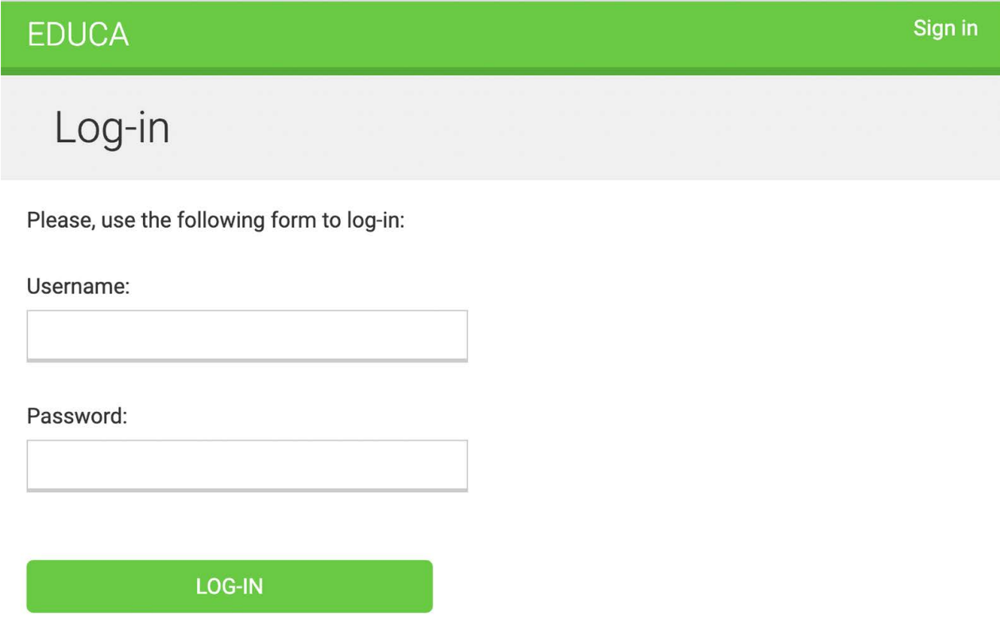
2. Account Logout Page:

   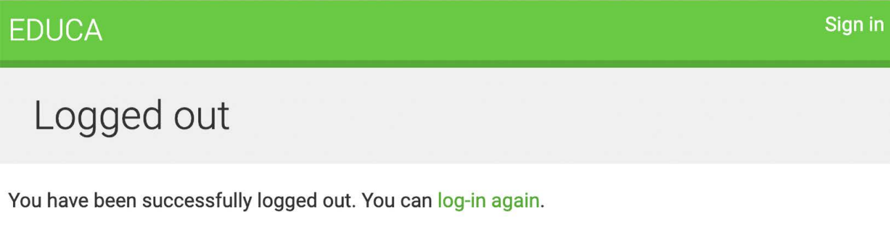
3. Instructor Course Page with no course:

   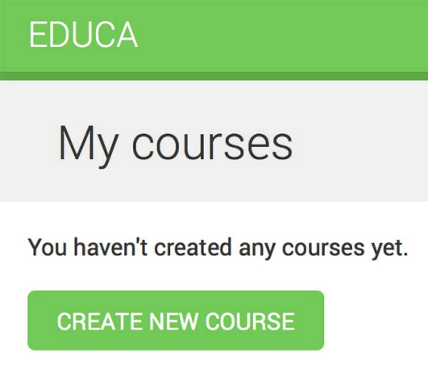
4. Course create form:

   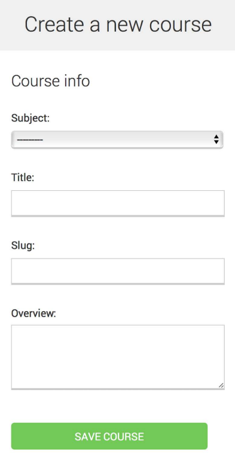
5. Instructor courses page with one course:

   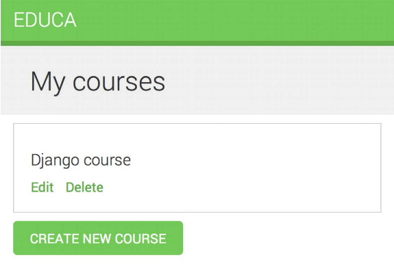
6. Course delete confirmation page:

   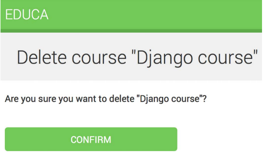
7. Course edit page, including the formset for course modules:

   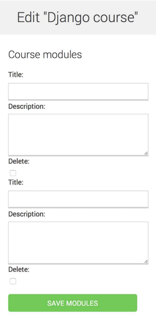
8. Add new image content form:

   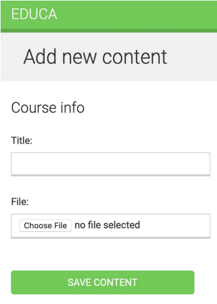
9. Course, Module, Contents management page:

   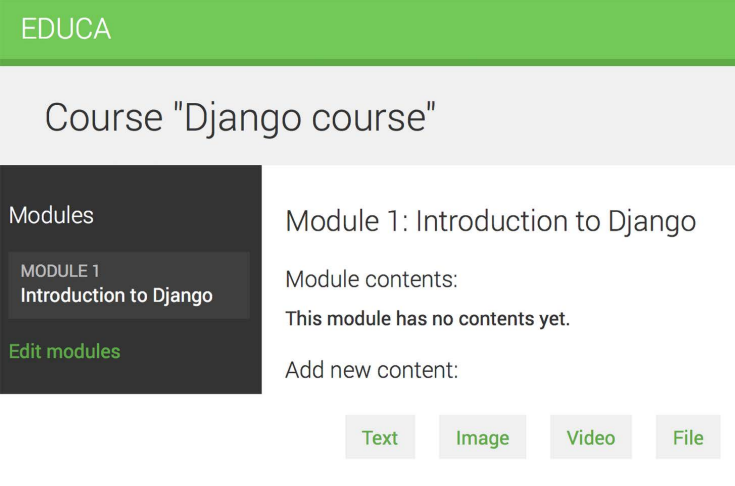
10. Managing different module contents:

    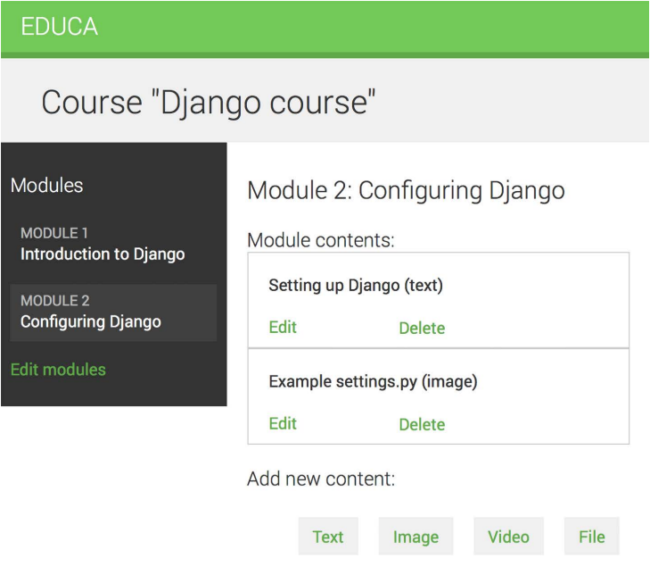
11. Reordering modules with drag and drop functionality:

    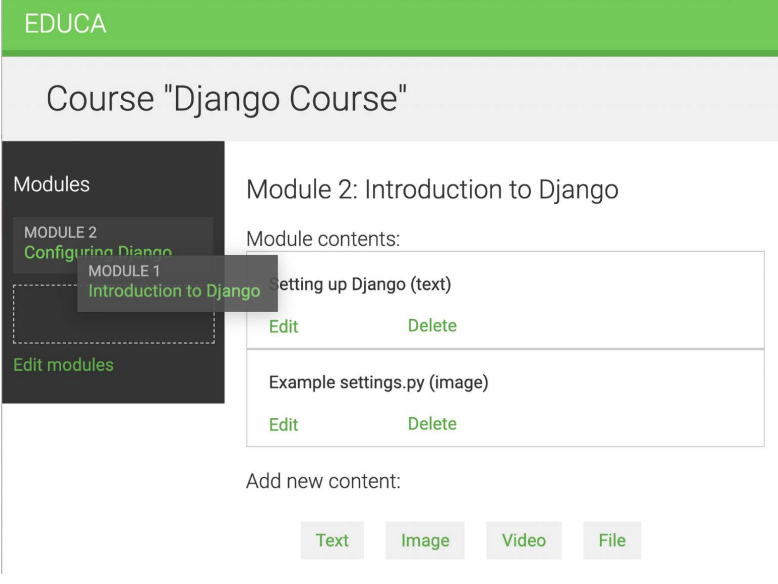
12. Reordering module contents with drag and drop functionality:

    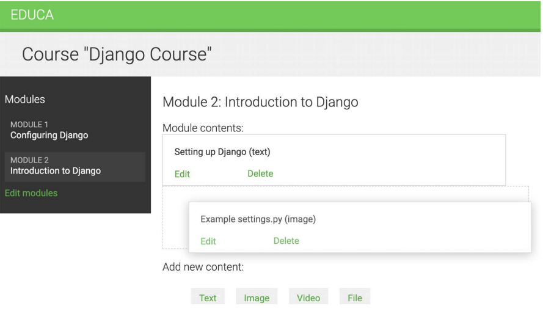
13. Course List page:

    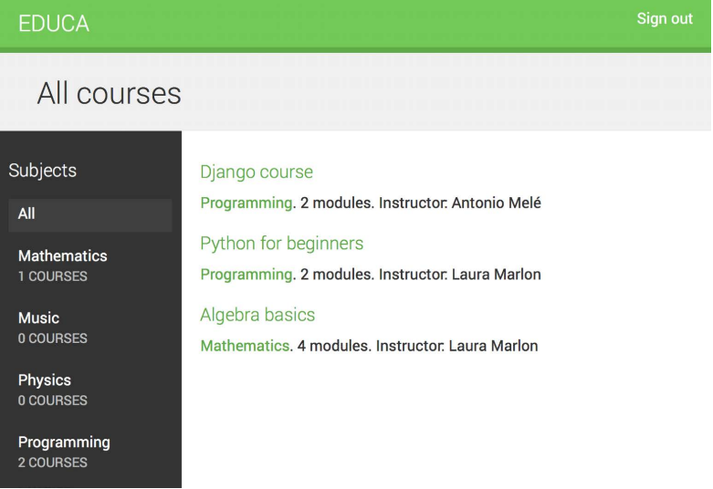
14. Student Registration Form:

    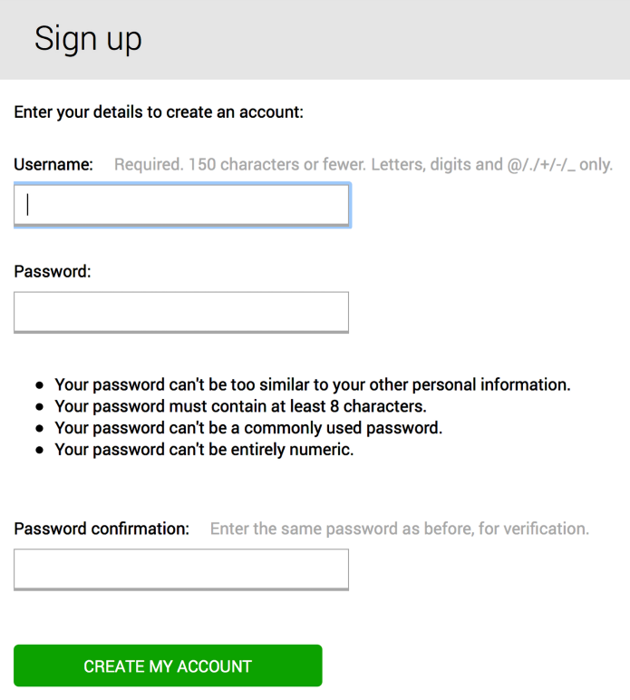
15. Course Content Page

    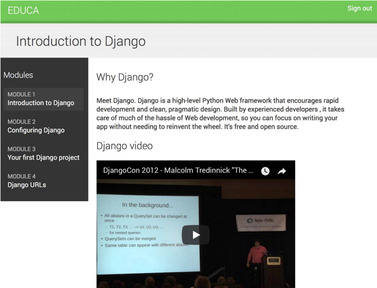
16. Course Chat Room Page:

    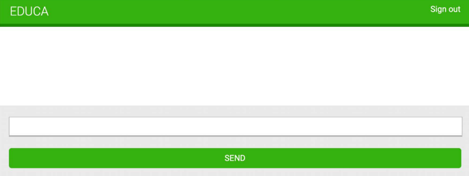
17. Chat Room Page but messages sent through WebSocket:

    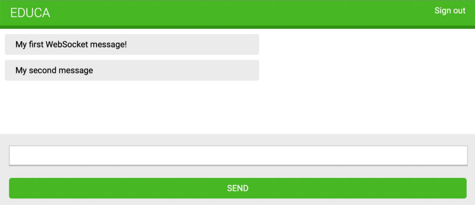
18. Chat Room Pages with messages sent from different browser windows:

    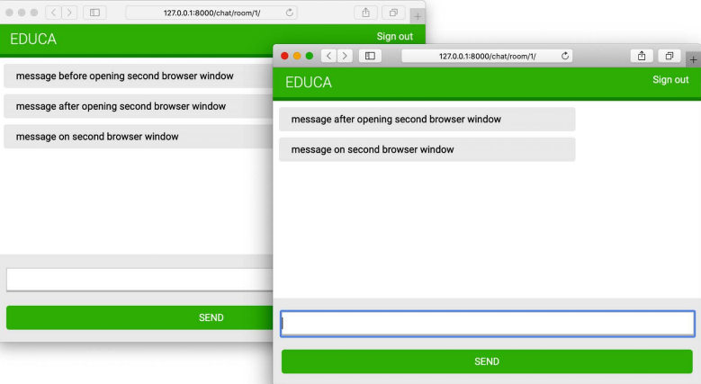
19. Chat Room Pages with messages from two different user sessions:

    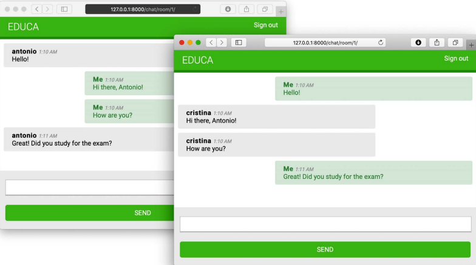
20. Course detail page, including a link to the course chat room:

    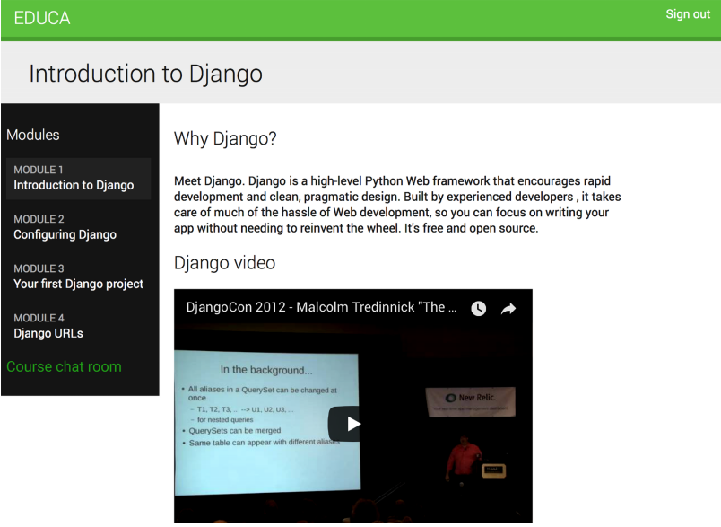
